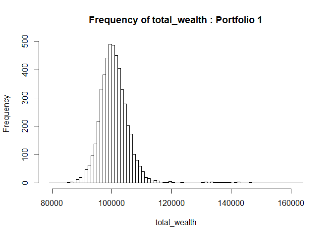
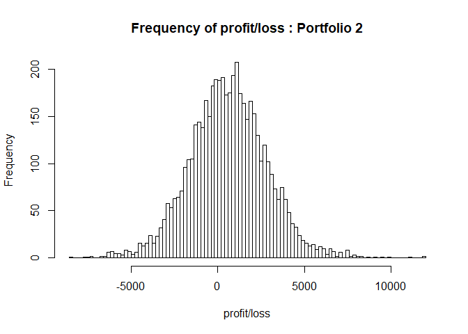
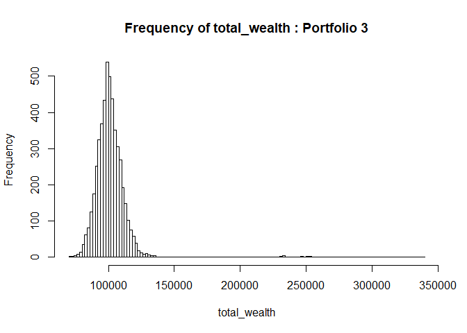
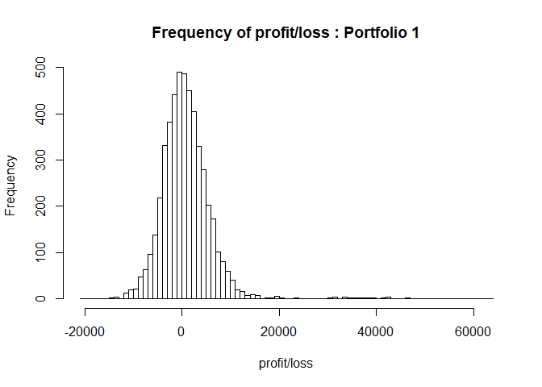

STA 380, Part 2: Exercises 1
================
Bhat Cui Ishita Srikanth
August 8, 2017


### Exploratory analysis : green buildings

\*\*\* Step 1 : Analysis of conclusions by stats guru \*\*\*

``` r
library(ggplot2)
greenbuildings = read.csv('greenbuildings.csv')
qplot(greenbuildings$age, greenbuildings$Rent, col=greenbuildings$green_rating,xlab='Age',ylab='Rent', main='Age vs Rent')
```


``` r
lm_green = lm(Rent~., data = greenbuildings)
summary(lm_green)
```

    ## 
    ## Call:
    ## lm(formula = Rent ~ ., data = greenbuildings)
    ## 
    ## Residuals:
    ##     Min      1Q  Median      3Q     Max 
    ## -53.753  -3.581  -0.526   2.491 173.916 
    ## 
    ## Coefficients: (1 not defined because of singularities)
    ##                     Estimate Std. Error t value Pr(>|t|)    
    ## (Intercept)       -8.315e+00  1.018e+00  -8.167 3.67e-16 ***
    ## CS_PropertyID      2.959e-07  1.574e-07   1.879 0.060241 .  
    ## cluster            7.532e-04  2.840e-04   2.653 0.008006 ** 
    ## size               6.741e-06  6.561e-07  10.276  < 2e-16 ***
    ## empl_gr            6.450e-02  1.700e-02   3.794 0.000149 ***
    ## leasing_rate       9.454e-03  5.332e-03   1.773 0.076247 .  
    ## stories           -3.472e-02  1.617e-02  -2.147 0.031823 *  
    ## age               -1.249e-02  4.717e-03  -2.649 0.008096 ** 
    ## renovated         -1.425e-01  2.586e-01  -0.551 0.581681    
    ## class_a            2.872e+00  4.377e-01   6.563 5.63e-11 ***
    ## class_b            1.186e+00  3.427e-01   3.462 0.000539 ***
    ## LEED               1.877e+00  3.582e+00   0.524 0.600318    
    ## Energystar        -2.127e-01  3.818e+00  -0.056 0.955572    
    ## green_rating       6.969e-01  3.839e+00   0.182 0.855929    
    ## net               -2.559e+00  5.929e-01  -4.316 1.61e-05 ***
    ## amenities          6.703e-01  2.519e-01   2.661 0.007802 ** 
    ## cd_total_07       -1.248e-04  1.464e-04  -0.852 0.394005    
    ## hd_total07         5.354e-04  8.972e-05   5.967 2.52e-09 ***
    ## total_dd_07               NA         NA      NA       NA    
    ## Precipitation      4.830e-02  1.611e-02   2.997 0.002735 ** 
    ## Gas_Costs         -3.559e+02  7.842e+01  -4.538 5.76e-06 ***
    ## Electricity_Costs  1.886e+02  2.493e+01   7.563 4.38e-14 ***
    ## cluster_rent       1.008e+00  1.421e-02  70.949  < 2e-16 ***
    ## ---
    ## Signif. codes:  0 '***' 0.001 '**' 0.01 '*' 0.05 '.' 0.1 ' ' 1
    ## 
    ## Residual standard error: 9.413 on 7798 degrees of freedom
    ##   (74 observations deleted due to missingness)
    ## Multiple R-squared:  0.6126, Adjusted R-squared:  0.6116 
    ## F-statistic: 587.2 on 21 and 7798 DF,  p-value: < 2.2e-16

``` r
confint(lm_green)
```

    ##                           2.5 %        97.5 %
    ## (Intercept)       -1.031042e+01 -6.318866e+00
    ## CS_PropertyID     -1.274823e-08  6.044929e-07
    ## cluster            1.965648e-04  1.309816e-03
    ## size               5.455466e-06  8.027614e-06
    ## empl_gr            3.117504e-02  9.781761e-02
    ## leasing_rate      -9.977735e-04  1.990486e-02
    ## stories           -6.641221e-02 -3.019510e-03
    ## age               -2.174043e-02 -3.247434e-03
    ## renovated         -6.493550e-01  3.644221e-01
    ## class_a            2.014332e+00  3.730255e+00
    ## class_b            5.146205e-01  1.858306e+00
    ## LEED              -5.144756e+00  8.898379e+00
    ## Energystar        -7.696320e+00  7.270936e+00
    ## green_rating      -6.827645e+00  8.221535e+00
    ## net               -3.721388e+00 -1.396793e+00
    ## amenities          1.765464e-01  1.164024e+00
    ## cd_total_07       -4.118836e-04  1.622300e-04
    ## hd_total07         3.595319e-04  7.113003e-04
    ## total_dd_07                  NA            NA
    ## Precipitation      1.670653e-02  7.988585e-02
    ## Gas_Costs         -5.096286e+02 -2.021683e+02
    ## Electricity_Costs  1.396891e+02  2.374354e+02
    ## cluster_rent       9.805329e-01  1.036255e+00

From the above plot, we can see that most of the green-buldings are relatively new, while non-green buildings are distributed across both new and old. We do a linear regression to determine factors that contribute to rent, and we see that age is one of the factors having low p value,a negative intercept and a 95% confidence interval not containing 0. This shows that as the age increases, rent decreases. Thus, comparing the median rent of green buildings(all relatively new, hence higher rent) to median rent on non-green buildings(both new and old, hence more distributed rent) would always yeild us a result which says green buildings have higher rent than non-green. We need to compare green and non-green buildings of similar age to arrive at a more robust conclusion.

``` r
qplot(greenbuildings$cluster_rent, greenbuildings$Rent, col=greenbuildings$green_rating,xlab='Cluster Rent',ylab='Rent', main='Cluster Rent vs Rent')
```


We know that for each cluster, there is one cluster rent defined, and we have one green building in each cluster. Now from the above plot, we can see that there are more non-green buildings in the lower rent clusters than the higher rent clusters. Hence the median rent for non-green will be more inclined towards lower rent always in this case, and the median for green will be higher. This also proves that taking an overall median is not a good strategy in this problem statment.

``` r
count<-table(greenbuildings$green_rating,greenbuildings$amenities)

x <- barplot(count, col=c("yellow", "darkgreen"), 
    legend=TRUE, border=NA, xlim=c(0,8), args.legend=
        list(bty="n", border=NA), 
    ylab="Number of buildings", xlab="Amenities")
```

 We plotted the density of green and non-green buildings vs amenities, and we see that non-green buildings are distributed almost equally across amenities and non-amenities. However, there are more green buildings with amenities than without. Hence, median of green buildings will be probably be inclined towards higher rent( as buildings with amenities have higher rent, as seen in the regression coefficient and p values for amenities ).Thus, median would not be a right method to compare the rent of green and non-green buildings.

``` r
greenbuildings$Class=ifelse(greenbuildings$class_a==1,'a',ifelse(greenbuildings$class_b==1,'b','c'))
count2<-table(greenbuildings$green_rating,greenbuildings$Class)

x <- barplot(count2, col=c("yellow", "darkgreen"), 
    legend=TRUE, border=NA, xlim=c(0,8), args.legend=
        list(bty="n", border=NA), 
    ylab="Number of buildings", xlab="Class")
```

 From the above plot, we see that we have most of the green buildings in class a, unlike non green buildings. From the linear regression in step 1, we see that rent for class a and class b is higher than rent for class c ( postive coefficient, very low p value and 95% confidence interval not containing 0). Here again, we prove that median is not the right way to calculate the differnce of rent between green and non green buildings.

\*\*\* Step 2 : Improving the green building analysis \*\*\*

From the analysis of the conclusion by stats guru in step 1, we concluded that the method was incorrect due to uneven distribution of green and non-green buildings accross different parameters. Hence, we dedided that we needed to compare green and non-green buildings having similar properties.

In order to make non-green buildings dataset representative of the prpoperties of green buildings dataset, we first identified the importanat parameters affecting rent, such as size, class, net, amenities, stories, etc. We made an educated assumption of the size to be in the 25th-75th percentile. Through our previous analysis, we observed that the majority of the green buildings has amenities =1 , class= A and net =0. For stories, since we were given that the new building is going to be 15 stories high, we selected a range of 10-20 storied buildings in the data set for both, green and non-green buildings.Our calculations showed that the median rent for non-green buildings is higher, at $34.2 /sqft while the green building has a lower rent at $29/sqft. Also, we checked if the dataset for non-green buildings was more densly populated in the high rent clusters. From the plots below, we can see that the distribution is not non-uniform. Hence, it is not the distribution in this case which is resulting in higher rent for non-green buildings.

From this, we can conclude that if this is a class A, high quality green building with several amenities, it is better to build a non-green building as the returns are higher, from a business persepctive. FRom an ethical perspective, one can argue otherwise.

``` r
library(dplyr)
```

    ## 
    ## Attaching package: 'dplyr'

    ## The following objects are masked from 'package:stats':
    ## 
    ##     filter, lag

    ## The following objects are masked from 'package:base':
    ## 
    ##     intersect, setdiff, setequal, union

``` r
buildings_green = subset(greenbuildings, green_rating==1, select = -c(green_rating))
buildings_non_green = subset(greenbuildings, green_rating==0 ,select = -c(green_rating))

quantile(buildings_green$size,0.25)
```

    ##    25% 
    ## 120000

``` r
quantile(buildings_green$size,0.75)
```

    ##    75% 
    ## 417446

``` r
#Making subset of non green buildings to compare with green buildings
greenbuildings_comp = buildings_non_green %>% filter(size>120000 & size<417446,
                                                     stories>10 & stories<20,
                                                     amenities==1,
                                                     class_a==1,
                                                     class_b==0,
                                                     net==0)

greenbuildings_comp_green = buildings_green %>% filter(stories>10 & stories<20)
                                                  
#Getting median rent for green and non-green buildings
rent_green = median(greenbuildings_comp_green$Rent) #29
rent_nongreen = median(greenbuildings_comp$Rent) #34.2
rent_green
```

    ## [1] 29

``` r
rent_nongreen
```

    ## [1] 34.2

``` r
par(mfrow=c(1,2))

qplot(greenbuildings_comp$cluster_rent, greenbuildings_comp$Rent,xlab='Cluster Rent',ylab='Rent', main='Cluster Rent vs Rent: Non green')
```


``` r
qplot(greenbuildings_comp_green$cluster_rent, greenbuildings_comp_green$Rent,,xlab='Cluster Rent',ylab='Rent', main='Cluster Rent vs Rent:Green')
```

    ## Warning: Ignoring unknown parameters: NA


### Bootstrapping

``` r
library(mosaic)
```

    ## Loading required package: lattice

    ## Loading required package: ggformula

    ## 
    ## New to ggformula?  Try the tutorials: 
    ##  learnr::run_tutorial("introduction", package = "ggformula")
    ##  learnr::run_tutorial("refining", package = "ggformula")

    ## Loading required package: mosaicData

    ## 
    ## The 'mosaic' package masks several functions from core packages in order to add 
    ## additional features.  The original behavior of these functions should not be affected by this.
    ## 
    ## Note: If you use the Matrix package, be sure to load it BEFORE loading mosaic.

    ## 
    ## Attaching package: 'mosaic'

    ## The following objects are masked from 'package:dplyr':
    ## 
    ##     count, do, tally

    ## The following objects are masked from 'package:stats':
    ## 
    ##     binom.test, cor, cor.test, cov, fivenum, IQR, median,
    ##     prop.test, quantile, sd, t.test, var

    ## The following objects are masked from 'package:base':
    ## 
    ##     max, mean, min, prod, range, sample, sum

``` r
library(quantmod)
```

    ## Loading required package: xts

    ## Loading required package: zoo

    ## 
    ## Attaching package: 'zoo'

    ## The following objects are masked from 'package:base':
    ## 
    ##     as.Date, as.Date.numeric

    ## 
    ## Attaching package: 'xts'

    ## The following objects are masked from 'package:dplyr':
    ## 
    ##     first, last

    ## Loading required package: TTR

    ## Version 0.4-0 included new data defaults. See ?getSymbols.

``` r
library(foreach)
library(dplyr)
mystocks = c("SPY", "TLT", "LQD","EEM","VNQ")
myprices = getSymbols(mystocks, from = '2007-01-01')
```

    ## 'getSymbols' currently uses auto.assign=TRUE by default, but will
    ## use auto.assign=FALSE in 0.5-0. You will still be able to use
    ## 'loadSymbols' to automatically load data. getOption("getSymbols.env")
    ## and getOption("getSymbols.auto.assign") will still be checked for
    ## alternate defaults.
    ## 
    ## This message is shown once per session and may be disabled by setting 
    ## options("getSymbols.warning4.0"=FALSE). See ?getSymbols for details.

    ## 
    ## WARNING: There have been significant changes to Yahoo Finance data.
    ## Please see the Warning section of '?getSymbols.yahoo' for details.
    ## 
    ## This message is shown once per session and may be disabled by setting
    ## options("getSymbols.yahoo.warning"=FALSE).

    ## Warning: LQD contains missing values. Some functions will not work if
    ## objects contain missing values in the middle of the series. Consider using
    ## na.omit(), na.approx(), na.fill(), etc to remove or replace them.

``` r
for(ticker in mystocks) {
  expr = paste0(ticker, "a = adjustOHLC(", ticker, ")")
  eval(parse(text=expr))
}
all_returns = cbind(ClCl(SPYa),ClCl(TLTa),ClCl(LQDa),ClCl(EEMa),ClCl(VNQa))
all_returns = as.matrix(na.omit(all_returns))
```

|                                                                                                      |
|:-----------------------------------------------------------------------------------------------------|
| Q1 Marshal appropriate evidence to characterize the risk/return properties of the five asset classes |

Q1 step1. Look at close-to-close changes plots

``` r
plot(all_returns[,1],type='l',main='SPY', xlab='01/02/2007 to 08/07/2017', ylab = 'returns' ) 
```


``` r
plot(all_returns[,2],type='l',main='TLT', xlab='01/02/2007 to 08/07/2017', ylab = 'returns' ) 
```


``` r
plot(all_returns[,3],type='l',main='LQD', xlab='01/02/2007 to 08/07/2017', ylab = 'returns' ) 
```

 SPY, the stock market risk in general. TLT, more stable than stock market index. LQD, the safest choice so far.

``` r
plot(all_returns[,4],type='l',main='EEM', xlab='01/02/2007 to 08/07/2017', ylab = 'returns' ) 
```


``` r
plot(all_returns[,5],type='l',main='VNQ', xlab='01/02/2007 to 08/07/2017', ylab = 'returns' ) 
```

 EEM, looks pretty stable but there are strange outliers that has magnified the scale of y. So we'd better look at it from 2009 to get a clearer idea. VNQ, also looks fluctuant. So again we need to change the scale of y.

``` r
mystocks_2009 = c("EEM","VNQ")
myprices_2009 = getSymbols(mystocks_2009, from = '2009-01-01')
EEM_2009a = adjustOHLC(EEM)
VNQ_2009a = adjustOHLC(VNQ)
plot(ClCl(EEM_2009a)) 
```


``` r
plot(ClCl(VNQ_2009a)) 
```

 As we can see from the new plot, EEM and VNQ are more volatile than SPY (EEM&gt; VNQ).

Then we got a rough risk ranking of these ETFs: EEM&gt; VNQ&gt; SPY&gt; TLT&gt; LQD. After learning about these ETFs, our intuition told us this ranking made perfect sense.

------------------------------------------------------------------------

Q1 step2. Look at the variances and average returns.

``` r
colMeans(all_returns)
```

    ##    ClCl.SPYa    ClCl.TLTa    ClCl.LQDa    ClCl.EEMa    ClCl.VNQa 
    ## 0.0003564144 0.0003100509 0.0002293594 0.0010539200 0.0004284578

``` r
apply(all_returns, 2, var)
```

    ##    ClCl.SPYa    ClCl.TLTa    ClCl.LQDa    ClCl.EEMa    ClCl.VNQa 
    ## 1.635457e-04 8.839261e-05 2.921055e-05 1.760754e-03 4.835779e-04

The above showed: A risk ranking (by variance): EEM&gt; VNQ&gt; SPY&gt; TLT&gt; LQD, which is exactly in the same order as we saw in plots. A returns ranking (by mean): EEM&gt; VNQ&gt; SPY&gt; TLT&gt; LQD. This ranking of returns is same as the ranking of risk(higher returns come with higher risk). In conclusion, LQD and TLT produce relatively lower but stabler returns while EEM provides the highest expected returns together with the highest risk. Meanwhile, SPY and VNQ have medium returns and risk (SPY slightly higher than VNQ). ------------------------------------------------------------------------------------------------------------------------------------------

Q1 step3. Look at the correlations and autocorrelations

``` r
pairs(all_returns)
```

 These returns can be viewed as draws from the joint distribution

``` r
cor(all_returns)
```

    ##            ClCl.SPYa  ClCl.TLTa  ClCl.LQDa   ClCl.EEMa   ClCl.VNQa
    ## ClCl.SPYa  1.0000000 -0.4436811 0.10258006  0.40342388  0.77663305
    ## ClCl.TLTa -0.4436811  1.0000000 0.42142782 -0.16877436 -0.26527461
    ## ClCl.LQDa  0.1025801  0.4214278 1.00000000  0.08802841  0.06701479
    ## ClCl.EEMa  0.4034239 -0.1687744 0.08802841  1.00000000  0.29135938
    ## ClCl.VNQa  0.7766330 -0.2652746 0.06701479  0.29135938  1.00000000

The sample correlation matrix All of them have positive correlations between each other(since they all change with the economic cycle) except that TLT is negatively correlated with SPY, EEM and VNQ.

|                                                                    |
|:-------------------------------------------------------------------|
| Q2 Outlines your choice of the "safe" and "aggressive" portfolios. |

From what we got in Question 1, to find the safe portfolio, we can: 1.use the funds with smaller variances (also relatively lower returns) like LQD, TLT, and SPY 2.choose the funds that have low correlations between them, especially consider using TLT together with other funds (hedging)

\*Therefore, we try allocating 40% of asset in LQD, 30% of asset in TLT, 30% of asset in SPY

As for discovering the aggressive portfolio, we have following strategies: 1.use the funds with the biggest variances (also the highest returns) like EEM, VNQ, and SPY 2.choose the funds that have high correlations between them, specifically we should exclude TLT 3.choose only very few funds so that the risk can not be shared

\*Thus here we allocate 80% of asset in EEM and 20% of asset in VNQ

|                                                                                                                                    |
|------------------------------------------------------------------------------------------------------------------------------------|
| Q3 Use bootstrap resampling to estimate the 4-week (20 trading day) value at risk of each of the three portfolios at the 5% level. |

Q3 step1. Simulate the first portfolio(the even split: 20% of assets in each of the five ETFs).

Looped over four trading weeks. Simulated for 5000 times and got the mean returns.

``` r
initial_wealth = 100000
sim1 = foreach(i=1:5000, .combine='rbind') %do% {
  total_wealth = initial_wealth
  weights = c(0.2, 0.2, 0.2, 0.2, 0.2)
  holdings = weights * total_wealth
  n_days = 20
  wealthtracker = rep(0, n_days)
  for(today in 1:n_days) {
    return.today = resample(all_returns, 1, orig.ids=FALSE)
    holdings = holdings + holdings*return.today
    total_wealth = sum(holdings)
    wealthtracker[today] = total_wealth
  }
  wealthtracker
}
```

``` r
hist(sim1[,n_days], 100,main='Frequency of total_wealth : Portfolio 1',xlab='total_wealth')
```



``` r
hist(sim1[,n_days]- initial_wealth, breaks=100, main='Frequency of profit/loss : Portfolio 1', xlab = 'profit/loss')
```


``` r
mean(sim1[,n_days]) 
```

    ## [1] 100929.7

``` r
var(sim1[,n_days])
```

    ## [1] 30298982

``` r
quantile(sim1[,n_days], 0.05) - initial_wealth
```

    ##        5% 
    ## -6193.227

According to the simulation, the 4-week 5% value at risk is about -$6600.

------------------------------------------------------------------------

Q3 Step2. Now simulate the safe portfolio : 40% of asset in LQD, 30% of asset in TLT, 30% of asset in SPY

``` r
initial_wealth = 100000
sim2 = foreach(i=1:5000, .combine='rbind') %do% {
  total_wealth = initial_wealth
  weights = c(0.3, 0.3, 0.4, 0.0, 0.0)
  holdings = weights * total_wealth
  n_days = 20
  wealthtracker = rep(0, n_days)
  for(today in 1:n_days) {
    return.today = resample(all_returns, 1, orig.ids=FALSE)
    holdings = holdings + holdings*return.today
    total_wealth = sum(holdings)
    wealthtracker[today] = total_wealth
  }
  wealthtracker
}
```

``` r
hist(sim2[,n_days], 100,main='Frequency of total_wealth : Portfolio 2',xlab='total_wealth')
```


``` r
hist(sim2[,n_days]- initial_wealth, breaks=100, main='Frequency of profit/loss : Portfolio 2', xlab = 'profit/loss')
```



``` r
mean(sim2[,n_days]) 
```

    ## [1] 100594.7

``` r
var(sim2[,n_days])
```

    ## [1] 5007218

The variance is far smaller than that of portfolio 1

``` r
# Calculate 5% value at risk
quantile(sim2[,n_days], 0.05) - initial_wealth
```

    ##        5% 
    ## -2946.111

According to the simulation, the 4-week 5% value at risk is about -$-3100 (much better than the even split)

As a conclusion, our second portfolio has mean returns lower than the first one, but has much smaller variance and thus less value at risk. It is a safer porfolio than the first one.

------------------------------------------------------------------------

Q3 Step3. Now simulate the aggresive portfolio : 80% of asset in EEM and 20% of asset in VNQ

``` r
initial_wealth = 100000
sim3 = foreach(i=1:5000, .combine='rbind') %do% {
  total_wealth = initial_wealth
  weights = c(0.0, 0.0, 0.0, 0.8, 0.2)
  holdings = weights * total_wealth
  n_days = 20
  wealthtracker = rep(0, n_days)
  for(today in 1:n_days) {
    return.today = resample(all_returns, 1, orig.ids=FALSE)
    holdings = holdings + holdings*return.today
    total_wealth = sum(holdings)
    wealthtracker[today] = total_wealth
  }
  wealthtracker
}
```

``` r
hist(sim3[,n_days], 100,main='Frequency of total_wealth : Portfolio 3',xlab='total_wealth')
```



``` r
hist(sim3[,n_days]- initial_wealth, breaks=100, main='Frequency of profit/loss : Portfolio 3', xlab = 'profit/loss')
```


``` r
mean(sim3[,n_days]) 
```

    ## [1] 101530.1

``` r
var(sim3[,n_days])
```

    ## [1] 211787753

``` r
quantile(sim3[,n_days], 0.05) - initial_wealth
```

    ##        5% 
    ## -13401.43

According to our simulation, the 4-week value at risk is about -$12900, which shows far more risk than the above portfolios.

The third portfolio has mean returns higher than others', but has much higher variance and thus more value at risk. It is a more aggresive but also riskier option than the other ones.

|                                                                                                                                         |
|:----------------------------------------------------------------------------------------------------------------------------------------|
| Q4 Compare the results for each portfolio in a way that would allow the reader to make an intelligent decision among the three options. |

``` r
means<-c(mean(sim1[,n_days]) , mean(sim2[,n_days]),mean(sim3[,n_days]))
means
```

    ## [1] 100929.7 100594.7 101530.1

``` r
vars<-c(var(sim1[,n_days]),var(sim2[,n_days]),var(sim3[,n_days]))
vars
```

    ## [1]  30298982   5007218 211787753

``` r
hist(sim1[,n_days]- initial_wealth, breaks=100, main='Frequency of profit/loss : Portfolio 1', xlab = 'profit/loss')
```



``` r
hist(sim2[,n_days]- initial_wealth, breaks=100, main='Frequency of profit/loss : Portfolio 2', xlab = 'profit/loss')
```


``` r
hist(sim3[,n_days]- initial_wealth, breaks=100, main='Frequency of profit/loss : Portfolio 3', xlab = 'profit/loss')
```


``` r
VaR_sim1=quantile(sim1[,n_days], 0.05) - initial_wealth
VaR_sim2=quantile(sim2[,n_days], 0.05) - initial_wealth
VaR_sim3=quantile(sim3[,n_days], 0.05) - initial_wealth
VaRs<-c(VaR_sim1,VaR_sim2,VaR_sim3)
VaRs
```

    ##         5%         5%         5% 
    ##  -6193.227  -2946.111 -13401.433

-   Suggestions for investment

\*The second portfolio might not provide a high expectation for returns (approximately $600, or 0.6% through 4 weeks) but it keeps investors away from high risk. It guarantees that 95% of time, their maximum loss would be limited to about $3000, or 3.0% in percentage. Thus we consider this as a safe strategy, which could be the ideal one for risk averters and those who merely want maintenance of assets value.

\*On the contrary, the third portfolio provides high expected returns (approximately $1800, or 1.8% through 4 weeks). However it's also a dangerous option because the investors are at the same time exposed to more risk. The loss could be rather high. (5% of time, they could lose over $12900, 12.9% in percentage) Therefore, this portfolio would be recommended to those players with some "all-in spirit", i.e. who are willing to take the risk for higher returns.

### Market segmentation

This report analyzes potential customer base for NutritionH20 by studying the tweets of its twitter followers. Each tweet from each follower is classifies into one of the 36 categories that indicates some of the interests of the same followers. We begin our analyzes with a simple bar plot that helps us visualize the frequency of each category. This gives us a broad idea of what is a common interest or ideas of several followers.

``` r
library(ggplot2)
library(dplyr)
library(LICORS)
library(reshape2)
Social_Market=read.csv("social_marketing.csv")
#head(Social_Market)
Social_Market2=Social_Market[, -cbind(1,2,6)]
head(Social_Market2)
```

    ##   current_events travel photo_sharing tv_film sports_fandom politics food
    ## 1              0      2             2       1             1        0    4
    ## 2              3      2             1       1             4        1    2
    ## 3              3      4             3       5             0        2    1
    ## 4              5      2             2       1             0        1    0
    ## 5              2      0             6       0             0        2    0
    ## 6              4      2             7       1             1        0    2
    ##   family home_and_garden music news online_gaming shopping
    ## 1      1               2     0    0             0        1
    ## 2      2               1     0    0             0        0
    ## 3      1               1     1    1             0        2
    ## 4      1               0     0    0             0        0
    ## 5      1               0     0    0             3        2
    ## 6      1               1     1    0             0        5
    ##   health_nutrition college_uni sports_playing cooking eco computers
    ## 1               17           0              2       5   1         1
    ## 2                0           0              1       0   0         0
    ## 3                0           0              0       2   1         0
    ## 4                0           1              0       0   0         0
    ## 5                0           4              0       1   0         1
    ## 6                0           0              0       0   0         1
    ##   business outdoors crafts automotive art religion beauty parenting dating
    ## 1        0        2      1          0   0        1      0         1      1
    ## 2        1        0      2          0   0        0      0         0      1
    ## 3        0        0      2          0   8        0      1         0      1
    ## 4        1        0      3          0   2        0      1         0      0
    ## 5        0        1      0          0   0        0      0         0      0
    ## 6        1        0      0          1   0        0      0         0      0
    ##   school personal_fitness fashion small_business spam adult
    ## 1      0               11       0              0    0     0
    ## 2      4                0       0              0    0     0
    ## 3      0                0       1              0    0     0
    ## 4      0                0       0              0    0     0
    ## 5      0                0       0              1    0     0
    ## 6      0                0       0              0    0     0

``` r
attach(Social_Market2)
#summary(Social_Market2)
#str(Social_Market2)

#Get frequency of topics talked about by twitter users
interest_sum=as.data.frame(colSums(Social_Market2[,-1]))
colnames(interest_sum) <- "sum"
interest_sum$variable <- as.factor(rownames(interest_sum))
rownames(interest_sum) <- 1:nrow(interest_sum)
ggplot(interest_sum,aes(x=variable,y=sum)) + 
  geom_bar(stat='identity') + 
  theme(axis.text.x = element_text(angle = 90, hjust = 1))
```


In the barplot above, what stands out the most chatter. However, chatter comprises of a lot of different topics and hence cannot be correctly used to determine interests. More relevant topics like health\_nutrition, cooking,photo\_sharing also have high occurance rate. Thus, these groups were looked at in greater detail in order to find other similarities among them.

``` r
#Find correlation between different features
sm_cor <- as.matrix(cor(Social_Market[,-1]))
sm_cor_melt <- arrange(melt(sm_cor), -abs(value))
#sm_cor_melt
```

The above table gives us the correlation between each of our features. We see that our intuitions are confirmed through data depicting correlations that we would expect. To get more information on the traits of various users, 3 techniques were applied. First, PCA was done with no success. Next, a hierarchichal cluster was tried on the dataset but this too did not give satisfactory results. Finally, K-means technique successfully brought out specific traits of followers who tweet about various different topics.

``` r
# Try PCA to get significant features.
SM_scaled <- scale(Social_Market2, center=TRUE, scale=TRUE) 
#summary(SM_scaled)
mu = attr(SM_scaled,"scaled:center")
sigma = attr(SM_scaled,"scaled:scale")

pc1 = prcomp(SM_scaled)
summary(pc1)
```

    ## Importance of components%s:
    ##                           PC1     PC2     PC3    PC4     PC5     PC6
    ## Standard deviation     2.0993 1.66487 1.59129 1.5295 1.46750 1.28559
    ## Proportion of Variance 0.1296 0.08152 0.07448 0.0688 0.06334 0.04861
    ## Cumulative Proportion  0.1296 0.21114 0.28562 0.3544 0.41776 0.46637
    ##                            PC7     PC8     PC9    PC10    PC11    PC12
    ## Standard deviation     1.21644 1.17388 1.15047 1.05257 0.99331 0.96364
    ## Proportion of Variance 0.04352 0.04053 0.03893 0.03259 0.02902 0.02731
    ## Cumulative Proportion  0.50989 0.55042 0.58935 0.62194 0.65096 0.67827
    ##                           PC13   PC14    PC15    PC16    PC17    PC18
    ## Standard deviation     0.96070 0.9347 0.92207 0.90804 0.85339 0.83369
    ## Proportion of Variance 0.02715 0.0257 0.02501 0.02425 0.02142 0.02044
    ## Cumulative Proportion  0.70541 0.7311 0.75612 0.78037 0.80179 0.82223
    ##                           PC19    PC20    PC21    PC22    PC23    PC24
    ## Standard deviation     0.80573 0.75319 0.69407 0.68451 0.65246 0.64867
    ## Proportion of Variance 0.01909 0.01668 0.01417 0.01378 0.01252 0.01238
    ## Cumulative Proportion  0.84132 0.85801 0.87218 0.88596 0.89848 0.91085
    ##                           PC25    PC26    PC27    PC28    PC29    PC30
    ## Standard deviation     0.63658 0.63183 0.61511 0.59922 0.59394 0.55072
    ## Proportion of Variance 0.01192 0.01174 0.01113 0.01056 0.01038 0.00892
    ## Cumulative Proportion  0.92277 0.93451 0.94564 0.95620 0.96658 0.97550
    ##                          PC31    PC32    PC33    PC34
    ## Standard deviation     0.4845 0.47782 0.43809 0.42201
    ## Proportion of Variance 0.0069 0.00672 0.00564 0.00524
    ## Cumulative Proportion  0.9824 0.98912 0.99476 1.00000

``` r
#par(mfrow=c(1,2))
#plot(SM_scaled, xlim=c(-2.5,2.5), ylim=c(-2.5,2.5))
```

``` r
# Try Hierarchical Clustering
SM_scaled_transpose=t(SM_scaled)

SM_scaled_dist = dist(SM_scaled_transpose, method='euclidean')

hier_sm_t = hclust(SM_scaled_dist, method='average')


# Plot the dendrogram
plot(hier_sm_t, cex=0.8)
```


``` r
## Kmeans method to find interesting associations within groups

##Find optimal K number of centres
k.max <- 15 # Maximal number of clusters
data <- SM_scaled
wss <- sapply(1:k.max, 
              function(k){kmeans(data, k, nstart=2 )$tot.withinss})
plot(1:k.max, wss,
     type="b", pch = 19, frame = FALSE, 
     xlab="Number of clusters K",
     ylab="Total within-clusters sum of squares")
```


``` r
#make K clusters
cluster_all <- kmeanspp(SM_scaled, k=6, nstart=50)
cluster_all$center[1,]
```

    ##   current_events           travel    photo_sharing          tv_film 
    ##     0.0001334616    -0.0092438772     0.0642389114     0.5219708951 
    ##    sports_fandom         politics             food           family 
    ##    -0.1158763985    -0.1649842785    -0.0700400900     0.1707647922 
    ##  home_and_garden            music             news    online_gaming 
    ##     0.1274040013     0.4461074879    -0.1942967509     2.9957904808 
    ##         shopping health_nutrition      college_uni   sports_playing 
    ##     0.0075824700    -0.1805403067     3.0384790755     1.9730039744 
    ##          cooking              eco        computers         business 
    ##    -0.1516790716    -0.0302961981    -0.0572943777     0.0376908835 
    ##         outdoors           crafts       automotive              art 
    ##    -0.0898405095     0.0965354412     0.0423084152     0.2851118311 
    ##         religion           beauty        parenting           dating 
    ##    -0.1280463843    -0.1876672310    -0.1632161278     0.0139269359 
    ##           school personal_fitness          fashion   small_business 
    ##    -0.2011885907    -0.1921075085    -0.0535415637     0.2540757469 
    ##             spam            adult 
    ##     0.0280967942     0.0241600638

``` r
cluster_all$center[2,]
```

    ##   current_events           travel    photo_sharing          tv_film 
    ##      0.120993627     -0.104372799     -0.025436802     -0.011517856 
    ##    sports_fandom         politics             food           family 
    ##      1.992788154     -0.204327879      1.785040205      1.442312695 
    ##  home_and_garden            music             news    online_gaming 
    ##      0.171444407      0.051469402     -0.081593904     -0.073798754 
    ##         shopping health_nutrition      college_uni   sports_playing 
    ##      0.050278899     -0.160603723     -0.120809840      0.103513946 
    ##          cooking              eco        computers         business 
    ##     -0.113117866      0.193719611      0.069436654      0.116546254 
    ##         outdoors           crafts       automotive              art 
    ##     -0.082890525      0.695516063      0.161999364      0.093168053 
    ##         religion           beauty        parenting           dating 
    ##      2.175518823      0.299126735      2.072341280      0.045153047 
    ##           school personal_fitness          fashion   small_business 
    ##      1.633450744     -0.115721487      0.016228421      0.105539405 
    ##             spam            adult 
    ##     -0.014661068      0.005548496

``` r
cluster_all$center[3,]
```

    ##   current_events           travel    photo_sharing          tv_film 
    ##      0.019638206     -0.153589376      0.002291646     -0.049831814 
    ##    sports_fandom         politics             food           family 
    ##     -0.196806571     -0.176309500      0.415359828     -0.069501886 
    ##  home_and_garden            music             news    online_gaming 
    ##      0.169663015      0.051469402     -0.049110034     -0.130862135 
    ##         shopping health_nutrition      college_uni   sports_playing 
    ##      0.052766362      2.093713116     -0.207522028     -0.025632200 
    ##          cooking              eco        computers         business 
    ##      0.371432702      0.532759430     -0.075368701      0.071056625 
    ##         outdoors           crafts       automotive              art 
    ##      1.615660280      0.094193809     -0.121654546      0.011485213 
    ##         religion           beauty        parenting           dating 
    ##     -0.174364062     -0.209977167     -0.100264020      0.181788655 
    ##           school personal_fitness          fashion   small_business 
    ##     -0.143401555      2.070945307     -0.108249268     -0.065515075 
    ##             spam            adult 
    ##      0.003346418     -0.001584891

``` r
cluster_all$center[4,]
```

    ##   current_events           travel    photo_sharing          tv_film 
    ##       0.18775203      -0.03680769       1.25305434      -0.02859905 
    ##    sports_fandom         politics             food           family 
    ##      -0.21470461      -0.12508340      -0.19912126       0.03485210 
    ##  home_and_garden            music             news    online_gaming 
    ##       0.14011507       0.52807920      -0.07190188      -0.06135653 
    ##         shopping health_nutrition      college_uni   sports_playing 
    ##       0.33660930      -0.06596576      -0.02830122       0.17170436 
    ##          cooking              eco        computers         business 
    ##       2.60858576       0.07648315       0.06359174       0.25681261 
    ##         outdoors           crafts       automotive              art 
    ##       0.02275679       0.14302548       0.05635440       0.11386586 
    ##         religion           beauty        parenting           dating 
    ##      -0.13151146       2.41374452      -0.08262480       0.13362898 
    ##           school personal_fitness          fashion   small_business 
    ##       0.18662311      -0.04670174       2.49234162       0.23206970 
    ##             spam            adult 
    ##      -0.03548519       0.00436950

``` r
cluster_all$center[5,]
```

    ##   current_events           travel    photo_sharing          tv_film 
    ##      0.110651237      1.761564348     -0.058123811      0.079255473 
    ##    sports_fandom         politics             food           family 
    ##      0.193290227      2.361751260      0.024799267      0.042747038 
    ##  home_and_garden            music             news    online_gaming 
    ##      0.122753025     -0.039203644      1.952363221     -0.141353617 
    ##         shopping health_nutrition      college_uni   sports_playing 
    ##     -0.005114433     -0.204201427     -0.079652771     -0.012285682 
    ##          cooking              eco        computers         business 
    ##     -0.215161115      0.105571138      1.546996732      0.360022180 
    ##         outdoors           crafts       automotive              art 
    ##      0.110788908      0.155984965      1.106934588     -0.001591712 
    ##         religion           beauty        parenting           dating 
    ##     -0.034555291     -0.174310023      0.015247008      0.200776434 
    ##           school personal_fitness          fashion   small_business 
    ##     -0.035810667     -0.190284008     -0.176436051      0.236384270 
    ##             spam            adult 
    ##     -0.007473870     -0.092611297

``` r
cluster_all$center[6,]
```

    ##   current_events           travel    photo_sharing          tv_film 
    ##     -0.064596032     -0.213018719     -0.151425757     -0.049035274 
    ##    sports_fandom         politics             food           family 
    ##     -0.287572776     -0.255730671     -0.353961101     -0.257261744 
    ##  home_and_garden            music             news    online_gaming 
    ##     -0.111185018     -0.124043005     -0.243249375     -0.233404079 
    ##         shopping health_nutrition      college_uni   sports_playing 
    ##     -0.061161953     -0.327090480     -0.228191739     -0.230135009 
    ##          cooking              eco        computers         business 
    ##     -0.334275122     -0.159861312     -0.233029570     -0.124109370 
    ##         outdoors           crafts       automotive              art 
    ##     -0.314124678     -0.186919505     -0.182075498     -0.060642380 
    ##         religion           beauty        parenting           dating 
    ##     -0.297554552     -0.267519126     -0.304886088     -0.091888934 
    ##           school personal_fitness          fashion   small_business 
    ##     -0.244818727     -0.333542495     -0.262883446     -0.095327811 
    ##             spam            adult 
    ##      0.004585328      0.010405002

``` r
qplot(beauty, fashion, data=Social_Market2, color=factor(cluster_all$cluster))
```


``` r
qplot(religion, parenting, data=Social_Market2, color=factor(cluster_all$cluster))
```


``` r
qplot(personal_fitness, health_nutrition,  data=Social_Market, color=factor(cluster_all$cluster))
```


``` r
qplot(politics, travel, data=Social_Market, color=factor(cluster_all$cluster))
```


``` r
qplot(college_uni, online_gaming, data=Social_Market, color=factor(cluster_all$cluster))
```


After studying the various things that the twitter followers talk about, some interesting traits were discovered among the followers, revealed through the K-means clustering tequnique. For Cluster number 1, a higher values for fashion, beauty, shopping and cooking can be seen. This suggests that twitter users in this particular group maybe trendy millenials. Cluster 2 shows a more family oriented group of people who seem to care most about parenting, school, crafts, food, religion and family.cluster 3 explains the interests of a group of possibly young, outdoorsy people who are perhaps committed to a healthy lifestyle, discussing topics like personal fitness and health and nutrition.Cluster 4 indicates a group of educated people whose interests are evident in the high values for computers, news, politics and travel. Cluster 5 could be depicting college adults with interests in online gaming, sports and university related activities.Finally, cluster 6 clubs the remaining followers together in a general category, where no particular interest stands out.

From the above results, it is recommended that NutritionH20 design a marketing strategy keeping the various similarities between the different twitter followers in mind. trendy people, families, educated, college-going adults and health concious youth can be targeted in various ways that specifically cater to their needs. If the given dataset is divided into further clusters, it can be seen that there isn't any one topic that seems to be of particular interest to the followers. Thus,these groups can benefit the most through general advertitizing.
